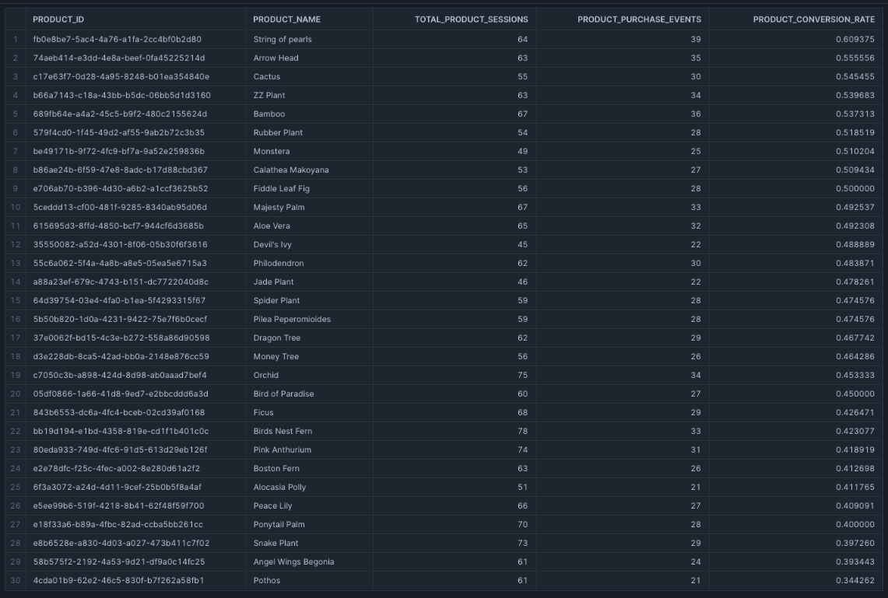

# Analytics engineering with dbt
# Project 3

## Part 1
###  What is the conversion rate?
- 0.624567
- model with answer: models/marts/core/fact__total_conversion_rate.sql

###  What is the conversion rate by product?
- average: 0.469430133333
- model with answer: - model with answer: models/marts/product/fact__product_conversion_rate.sql
- full list here:

## Part 6
### Which products had their inventory change from week 2 to week 3 based on the snapshot

select distinct name from DEV_DB.DBT_CECILIADEPMANMURMURATIONORG.products_inventory_snapshot where dbt_updated_at > '2024-10-21' 
- String of pearls
- Philodendron
- Pothos
- Bamboo
- Monstera
- ZZ Plant